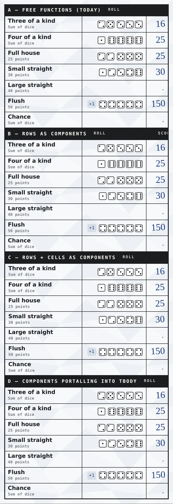

# Can score-card rows be rooted components?

**Answer: no — use free functions. A component host between `<tbody>` and `<tr>` destroys
the table's accessibility semantics.**

Measured 2026-08-20 against `@rooted/components@1.0.0-alpha.11`, Chromium 1194, as Phase 0a of
the `game/` component-split work (issue #88). The spike lived at `/poc-table/` and is reverted;
this document is what it produced.

## Why the question came up

Splitting `score-card.mts` (411 lines) into a component tree meant asking whether a row could
be a `component()`. Every rooted component instance is a real custom element in the DOM
(`<rooted-component>` in dev, `<r-->` in prod), made layout-transparent by an adopted stylesheet:

```css
r--, r--[r] { display: contents !important }
```

Outside tables that is genuinely invisible. Inside one it puts an element between `<tbody>` and
`<tr>`, and `display: contents` has a bad history there.

## What was tested

Four renderings of the same part-two table, side by side in one page:

| | rows | cells |
|---|---|---|
| **A** | free functions | free functions |
| **B** | `component()` | free functions |
| **C** | `component()` | `component()` |
| **D** | `component()`, portalled | free functions |



## Results

Accessibility counted from Chromium's own tree via CDP `Accessibility.getFullAXTree`
(cross-checked against Playwright's `accessibility.snapshot`; they agree):

| | `row` | `rowheader` | `cell` | `generic` | `tbody.rows` | `tr.cells` | `rowIndex` | cell widths (px) |
|---|---|---|---|---|---|---|---|---|
| A — free functions | 8 | 7 | 15 | 4 | 7 | 3 | 1 | 181.2 / 150 / 52.02 |
| B — rows as components | 1 | **0** | 1 | 25 | **0** | 3 | **-1** | 181.22 / 150 / 52 |
| C — rows + cells | 1 | **0** | 1 | 25 | **0** | **0** | **-1** | **0 / 0 / 0** |
| D — portalled | 8 | 7 | 15 | 4 | 7 | 3 | 1 | 181.19 / 150 / 52.03 |

`row: 8` is the `<thead>` band row plus seven data rows.

### The accessibility failure (B and C)

All seven data rows, all seven row headers and 14 of 15 cells **vanish** from the accessibility
tree. They are re-roled `generic`. The one surviving `row`/`cell` is the `<thead>` band, which
is not wrapped.

`display: contents` removes the host from the *layout* tree but not from the ARIA *containment*
chain, so `<tbody>` no longer sees `<tr>` children and the table stops being a table. A screen
reader reads the score pad as loose text — no row/column navigation, no row headers. That is
disqualifying for a score pad, and it is not a bug to work around; it is what the feature does.

### Layout and CSS

Visually and dimensionally **A and B are identical** (383.22px table, 37.28px rows, cell widths
within 0.02px). Selection-state styling — `data-selecting` / `data-target` / `data-hover`, the
discard slash, the valid-target inset shadow — is **byte-identical across all four**. Rooted's
CSS scoping is a descendant prefix (`.foo {}` → `[r="<scopeId>"] .foo {}`), so it passes through
the wrapper untouched.

**C** is the exception: rows render 1px narrower because
`score-card.css` `.score-table tbody tr > *:first-child|last-child` (which suppresses the outer
border) matches the wrapper instead of the `<td>`. Visible in the screenshot as an extra vertical
rule. Cell widths read 0 because `tr.children` are now zero-box hosts.

### DOM APIs

`tbody.rows` → 0 and `rowIndex` → -1 in B and C; `tr.cells` → 0 in C. Nothing in the app uses
these today (`grep` for `.rows` / `rowIndex` / `sectionRowIndex` / `.cells` is clean), but they
are a live trap.

## Variant D — the portal pattern

There *is* a shape that works. Keep the host connected so `onMount` runs and the signal stays
alive, but park it outside the table and render the `<tr>` into a tbody passed in as an option:

```ts
export const PortalRow = component<{ field: ScoreField, mount: HTMLElement }>({
    name: 'portal-row',
    styles,
    onMount({ element, signal, options }) {
        const row = element('tr', { /* … */ })
        options.mount.append(row)                                  // <tbody><tr> — no wrapper
        signal.addEventListener('abort', () => row.remove(), { once: true })
    },
})
```

D measures identical to A on every axis, and row order held across 8 cold loads. So rows *can*
be real components with full lifetime — own `signal`, own subscriptions, own CSS scope.

**It was still rejected**, because it is a second component system beside rooted's:

- Every table grows a hidden `<div>` of empty `<rooted-component>` elements.
- `mount: HTMLElement` inverts ownership — a child writing into a parent's node. That is the
  same shape as the `row-overlay` DOM surgery this refactor removes.
- Order is *emergent*: hosts are appended synchronously so their `queueMicrotask` mounts drain in
  order. Nothing in rooted promises this, and it breaks silently the day a row's `onMount`
  becomes `async` (which rooted permits).
- Append-only. Re-rendering one row needs `insertBefore` at the right index, so you end up
  tracking positions anyway — the bookkeeping the component was meant to save.

Decisively: **per-row granularity buys nothing here.** The reason to want row-level re-render
boundaries was the preview-injection race, and that is solved instead by having the score card
own preview rendering from a selection store. What remains is rebuilding a 7-row `<tbody>` on a
pad change, which for 13 rows plus 4 totals is free.

Keep D in mind only if rows ever need genuinely independent lifetime — per-row animation, or a
subscription to something other than the pad.

## What this means for the code

Rows and cells stay **free functions** with a component-shaped signature, so they read like
components without the machinery:

```ts
export function scoreRow(context: RenderContext, options: ScoreRowOptions): HTMLTableRowElement
```

`RenderContext = Pick<ComponentContext, 'element' | 'create'>`. The component boundaries are
`score-section` (instantiated twice) and `totals-table`, which share `score-table.css` — a free
function cannot own a stylesheet, because only a component host receives the `r` attribute that
the scoped rules match on.

## Side finding: every `:host { }` block in this app is dead

The CSS loader prefixes selectors unconditionally, with `:global()` as the only escape. So

```css
:host { display: block }        /* score-card.css:1 */
```

compiles to `[r="<scopeId>"] :host { display: block }`, which matches nothing. `score-card.css`,
`game.css` and `score-input.css` all open with one. They are no-ops — the host is
`display: contents !important` from the adopted sheet regardless. Drop them rather than carry
them into the split files.
